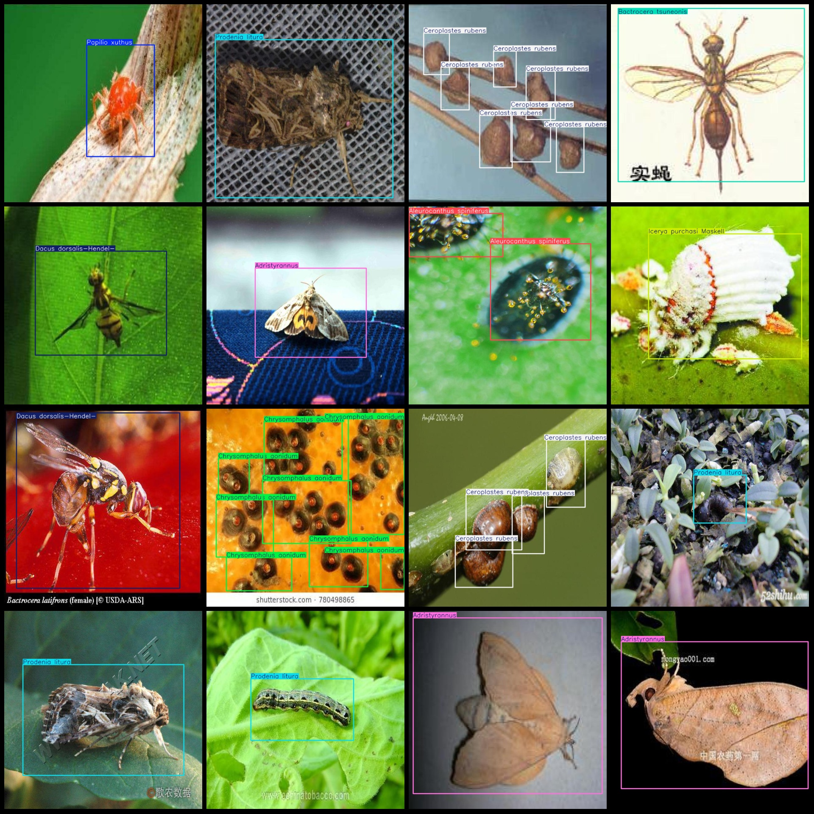
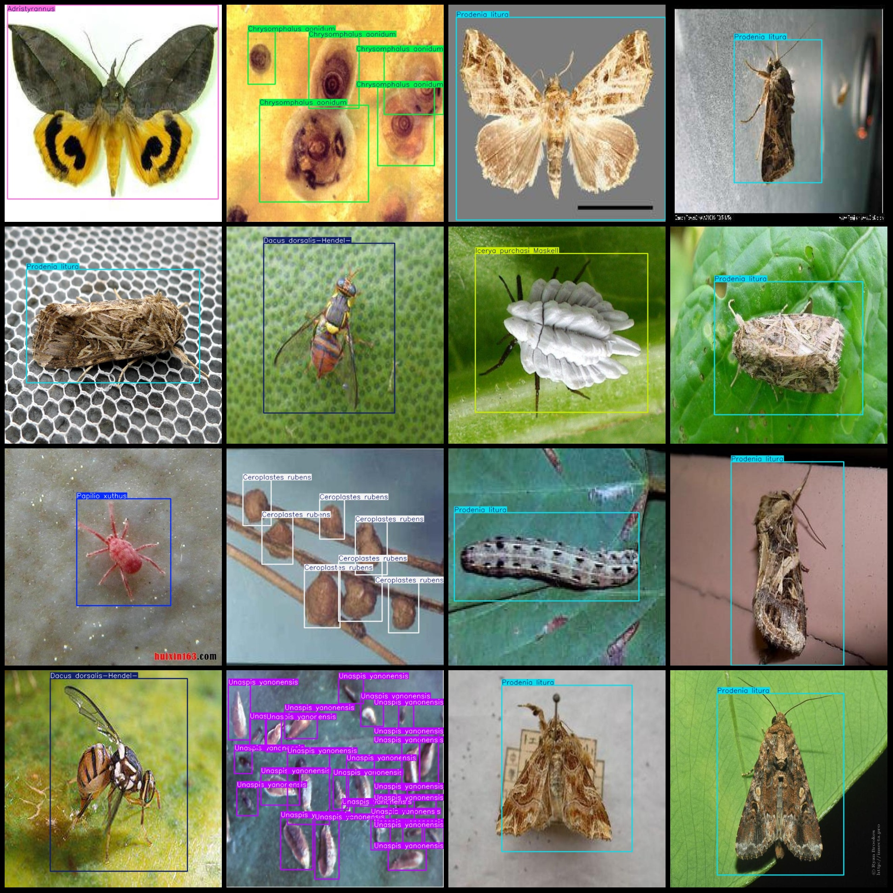

# Agricultural Insect Pest Detection Dataset in Smart Agriculture, VOC+YOLO Format, 1335 Images and 17 Categories

## Datasetformat: 
- Pascal VOC format
- YOLO format (txt files without split paths, only including jpg images, corresponding VOC format xml files, and yolo format txt files)

## Images Count:
- Number of jpg files: 1335

## Annotation Count:
- xmlfile Count: 1335
- txtfile Count: 1335

"Annotation class" is translated to "Annotation Class".
- 17

## Annotation category names (based on labels.txt in the labels folder):
- ["Adristyrannus", "Aleurocanthus spiniferus", "Aphis citricola Vander Goot", "Bactrocera tsuneonis", "Ceroplastes rubens", "Chrysomphalus aonidum", "Dacus dorsalis-Hendel-", "Icerya purchasi 
Maskell", "Nipaecoccus vastalor", "Panonchus citri McGregor", "Papilio xuthus", "Phyllocnistis citrella Stainton", "Prodenia litura", "Tetradacus c Bactrocera minax", "Toxoptera aurantii", "Toxoptera 
citricidus", "Unaspis yanonensis"]

## Total Box Counts:
- Adristyrannus (Adristyrannus) = 133
- Aleurocanthus spiniferus (Aleurocanthus) = 148
- Aphis citricola Vander Goot (Aphis citricola) = 8
- Bactrocera tsuneonis (Bactrocera tsuneonis) = 27
- Chrysomphalus aonidum (Chrysomphalus aonidum) = 183
- Dacus dorsalis-Hendel (Dacus dorsalis-Hendel) = 131
- Icerya purchasi Maskell (Icerya purchasi Maskell) = 290
- Nipaecoccus vastalor (Nipaecoccus vastalor) = 46
- Panonchus citri McGregor (Panonchus citri McGregor) = 82
- Papilio xuthus (Papilio xuthus) = 108
- Phyllocnistis citrella Stainton (Phyllocnistis citrella Stainton) = 23
- Prodenia litura (Prodenia litura) = 438
- Tetradacus c Bactrocera minax (Tetradacus c Bactrocera minax) = 58
- Toxoptera aurantii (Toxoptera aurantii) = 28
- Toxoptera citricidus (Toxoptera citricidus) = 22
- Unaspis yanonensis (Unaspis yanonensis) = 546
- Total box counts: 2641

The resolution of an image is the number of pixels in a given area of an image. The larger the resolution, the higher the quality of the image.
- 640x640

## Tools for Annotation
- labelImg

## Annotation Rule:
- Draw a box around the category

## Important Note:
- The dataset is not divided into training validation test sets. Please divide it yourself.
- Special Disclaimer: This dataset does not guarantee the accuracy of the trained model or the weights file.

## Images Preview:
## Images

Here is a pay link on Stripe ( https://buy.stripe.com/3cs8yP7sY87d0vu9AB ). Please contact me lonlonago@foxmail.com after funding $89, and I will send you a complete data files , thank you!

